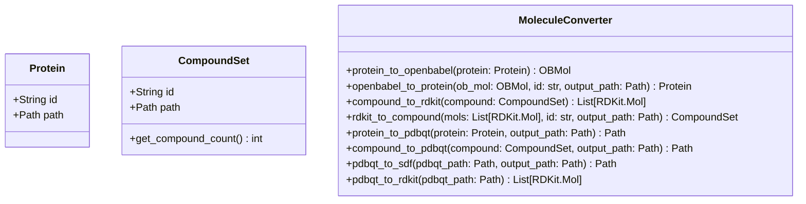
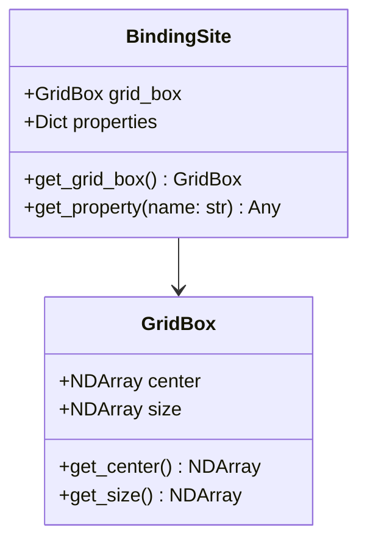
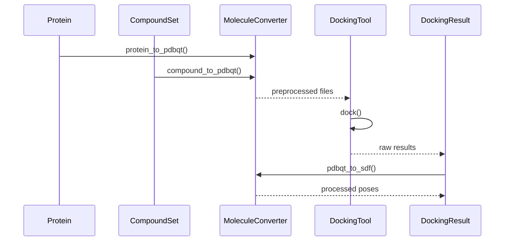
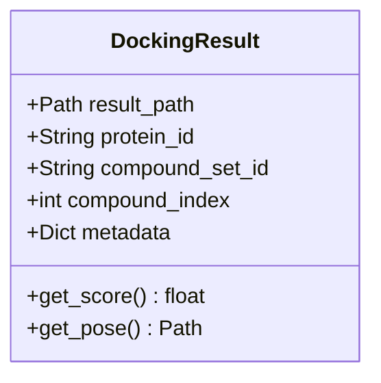
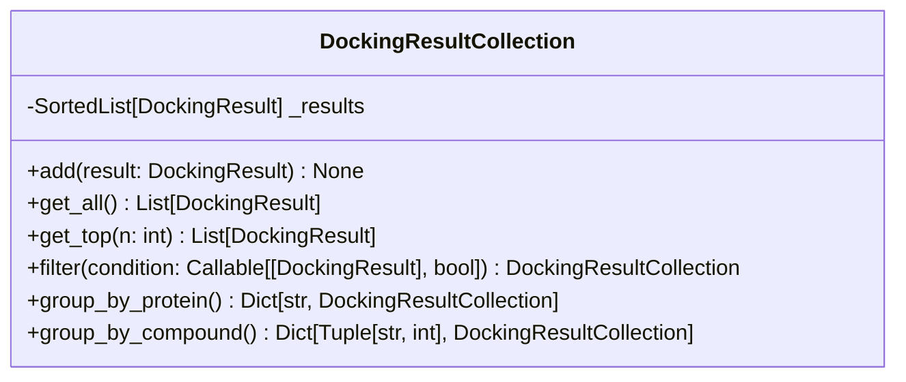
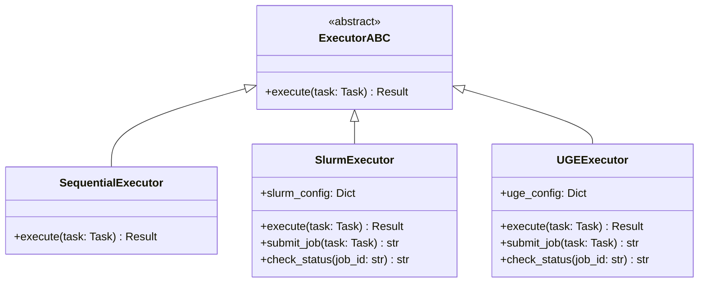
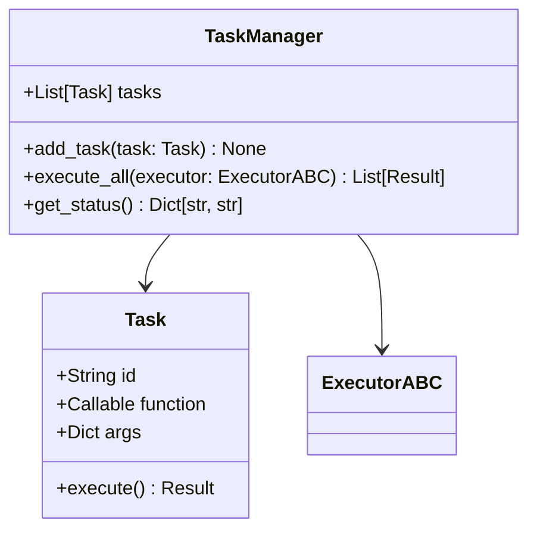
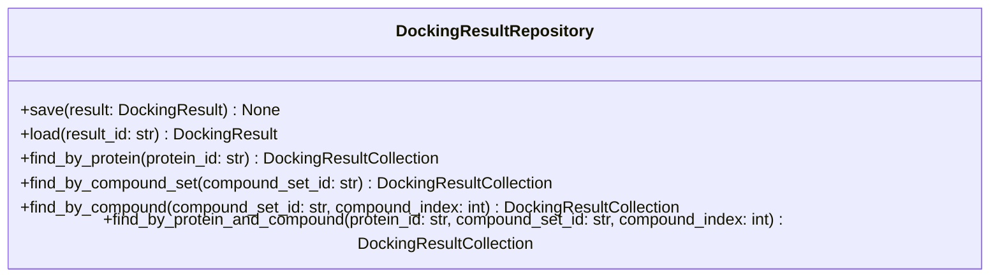

# docking_automation システム設計改善案と実装状況

この文書では、docking_automationシステムの設計改善案と、その実装状況について説明します。

## 実装状況の概要

設計に基づいて、以下の実装を行いました：

1. **基本クラス構造の実装**：
   - 新規作成: docking_automation/converters/molecule_converter.py
   - 新規作成: docking_automation/infrastructure/executor/task.py
   - 新規作成: docking_automation/infrastructure/executor/task_manager.py
   - 新規作成: docking_automation/docking/docking_result_collection.py
   - 修正: docking_automation/molecule/protein.py
   - 修正: docking_automation/molecule/compound_set.py
   - 修正: docking_automation/docking/docking_result.py
   - 修正: docking_automation/docking/grid_box.py
   - 修正: docking_automation/infrastructure/repositories/docking_result_repository.py
   - 修正: docking_automation/infrastructure/executor/executor.py
   - 修正: docking_automation/infrastructure/executor/sequential_executor.py
   - 修正: docking_automation/infrastructure/executor/slurm_executor.py

2. **テストフレームワークの実装**：
   - tests/molecule/test_protein.py
   - tests/molecule/test_compound_set.py
   - tests/converters/test_molecule_converter.py
   - tests/docking/test_grid_box.py
   - tests/docking/test_docking_result.py
   - tests/docking/test_docking_result_collection.py
   - tests/infrastructure/repositories/test_docking_result_repository.py
   - tests/infrastructure/executor/test_task.py
   - tests/infrastructure/executor/test_task_manager.py
   - tests/infrastructure/executor/test_sequential_executor.py
   - tests/infrastructure/executor/test_slurm_executor.py
   - tests/integration/test_docking_workflow.py
   - tests/conftest.py

3. **依存関係の管理**：
   - setup.pyの修正：sortedcontainersを依存関係に追加
   - 開発用依存関係（pytest, pytest-cov）の追加
   - 化学情報学ライブラリ（rdkit, openbabel-wheel, meeko）の追加

現時点では、すべてのメソッドはNotImplementedErrorを発生させるようになっており、具体的な実装は行っていません。これにより、設計の骨組みとテストフレームワークが整い、今後の実装作業の基盤が整いました。

## 1. ドメインモデルの充実化

### 分子表現の最適化

- 現在の`Protein`と`CompoundSet`クラスはファイルパスのみを保持する最小実装を維持
- RDKitとOpenBabelを積極的に活用し、コードを薄く保つ
- 分子変換処理を専用のコンバータクラスに集約



### ドメインオブジェクトの整理

- `Receptor`と`Ligand`の概念は`PreprocessedProtein`と`PreprocessedCompoundSet`に内包されているため追加しない
- `BindingSite`と`GridBox`の関係を整理



- 現段階では`GridBox`のみを使用
- 将来的に結合部位の特性を考慮する場合に`BindingSite`を導入

## 2. ドッキングワークフローの強化

### プロセスの完全定義

- 前処理→ドッキング計算→後処理の基本フローを明確に定義
- 後処理にはmeekoを使用したpdbqt→sdf/RDKit Mol変換を含める



### 複合ドッキング戦略

- 複合ドッキング戦略は今後の開発対象として一旦保留

## 3. 結果管理と分析フレームワーク

### 結果モデルの最適化



- 1つのタンパク質と1つの化合物のドッキング結果を表現
- `compound_index`フィールドを追加し、CompoundSet内の何番目の化合物かを記録
- 結果ファイルへのパスを主に保持し、必要に応じて読み込む設計
- `get_pose()`は1つのsdfファイルへのパスを返す（複数ポーズが含まれる場合もある）
- メタデータとして最低限の情報（使用したツール、パラメータなど）を保持

### 比較・ランキング機能



- `DockingResultCollection`クラスを導入し、複数の`DockingResult`を管理
- `sortedcontainers`パッケージの`SortedList`を使用し、常にドッキングスコアでソートされた状態を維持
- ソート状態が保証されることで、Top K取得などの操作が効率的に実行可能
- フィルタリング、グループ化などの操作を提供

## 4. 実行エンジンの強化

### タスク管理の高度化



- SLURMを優先的にサポートし、後にUniva Grid Engineも対応
- 各ジョブスケジューラに特化した設定と実行機能
- ジョブの状態管理と結果の回収機能

### スケーラビリティとリソース管理



- シンプルなタスク定義と管理
- 型情報の明確化
- 複雑なDAGベースのワークフローは現段階では実装せず（embarrassingly parallelな計算が多いため）

## 5. データ管理と永続化

### リポジトリパターンの完成



- タンパク質ID、化合物セットID、化合物インデックスによる検索機能
- 結果の保存と読み込み機能
- 検索結果を`DockingResultCollection`として返す

### フォーマット変換

- RDKit、OpenBabel、prepare_ligand、prepare_receptor、meekoを活用
- 自作のフォーマット変換は避け、既存ツールを積極的に利用

## 6. テストフレームワーク

### pytestを活用したテスト構造

```python
# tests/molecule/test_protein.py
import pytest
from pathlib import Path
from docking_automation.molecule.protein import Protein

class TestProtein:
    @pytest.fixture
    def sample_protein(self):
        # テスト用のProteinインスタンスを作成
        raise NotImplementedError()
    
    def test_protein_initialization(self, sample_protein):
        # Proteinの初期化をテスト
        raise NotImplementedError()

# tests/converters/test_molecule_converter.py
import pytest
from pathlib import Path
from docking_automation.molecule.protein import Protein
from docking_automation.molecule.compound_set import CompoundSet
from docking_automation.converters.molecule_converter import MoleculeConverter

class TestMoleculeConverter:
    @pytest.fixture
    def converter(self):
        # テスト用のMoleculeConverterインスタンスを作成
        raise NotImplementedError()
    
    @pytest.fixture
    def sample_protein(self):
        # テスト用のProteinインスタンスを作成
        raise NotImplementedError()
    
    @pytest.fixture
    def sample_compound_set(self):
        # テスト用のCompoundSetインスタンスを作成
        raise NotImplementedError()
    
    def test_protein_to_openbabel(self, converter, sample_protein):
        # Protein→OpenBabel変換をテスト
        raise NotImplementedError()
    
    def test_pdbqt_to_sdf(self, converter, tmp_path):
        # PDBQT→SDF変換をテスト
        raise NotImplementedError()
    
    def test_pdbqt_to_rdkit(self, converter):
        # PDBQT→RDKit変換をテスト
        raise NotImplementedError()
```

### 統合テスト構造

```python
# tests/integration/test_docking_workflow.py
import pytest
from pathlib import Path
from docking_automation.molecule.protein import Protein
from docking_automation.molecule.compound_set import CompoundSet
from docking_automation.docking.autodockvina_docking import AutoDockVina
from docking_automation.converters.molecule_converter import MoleculeConverter

class TestDockingWorkflow:
    @pytest.fixture
    def setup_docking(self, tmp_path):
        # テスト用のデータセットアップ
        raise NotImplementedError()
    
    def test_end_to_end_docking(self, setup_docking):
        # エンドツーエンドのドッキングプロセスをテスト
        raise NotImplementedError()
```

## 7. 実装優先度と次のステップ

1. **基本クラスの修正**：Protein, CompoundSetクラスにIDフィールドを追加、CompoundSetに化合物数取得メソッドを追加
2. **変換機能の実装**：MoleculeConverterクラスの実装（OpenBabel, RDKit, meeko活用、双方向変換）
3. **DockingResult修正**：compound_indexフィールドの追加、get_pose()メソッドの実装
4. **DockingResultCollection実装**：ソート機能を持つコレクションクラスの実装
5. **SLURMエグゼキュータ**：SLURMジョブスケジューラ対応の実装
6. **テストフレームワーク**：pytestを活用したテスト構造の実装

## 8. その他の考慮点

### 並列処理の最適化

- ドッキング計算はembarrassingly parallelな性質を持つため、シンプルな並列処理で効率化可能
- SLURMやUGEなどのジョブスケジューラを活用した並列実行

### ドキュメント

- 各クラスとメソッドにGoogleスタイルのdocstringを付与
- 型アノテーションを徹底し、mypy等での型チェックを実施

### 拡張性とプラグイン機構

- 新しいドッキングツールを容易に追加できるインターフェース設計
- 結果解析のためのプラグイン機構

これらの改善点を実装することで、RDKitやOpenBabelを積極的に活用しつつ、コードを薄く保ち、必要最小限の機能に焦点を当てたドッキング自動化フレームワークが構築できます。

## 9. 今後の展望

現在の実装は、設計の骨組みとテストフレームワークの構築に焦点を当てています。今後は以下の点に取り組む予定です：

1. **各クラスの具体的な実装**：
   - MoleculeConverterクラスの実装（OpenBabel, RDKit, meekoを活用）
   - DockingResultとDockingResultCollectionの実装
   - SLURMエグゼキュータの実装

2. **テストケースの充実**：
   - 単体テストの実装
   - 統合テストの実装
   - CI/CDパイプラインの構築

3. **ドキュメントの整備**：
   - APIリファレンスの作成
   - チュートリアルの作成
   - サンプルコードの作成

4. **パフォーマンスの最適化**：
   - 並列処理の最適化
   - メモリ使用量の最適化
   - 実行時間の短縮

これらの取り組みにより、効率的で拡張性の高いドッキング自動化フレームワークを構築し、創薬研究の効率化に貢献することを目指します。